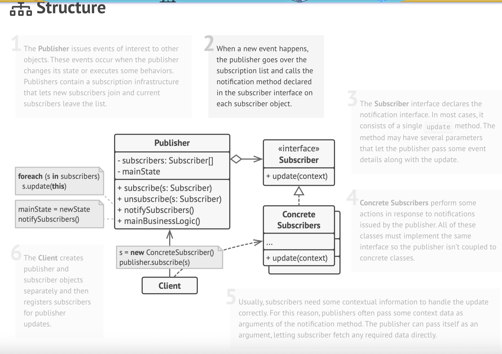
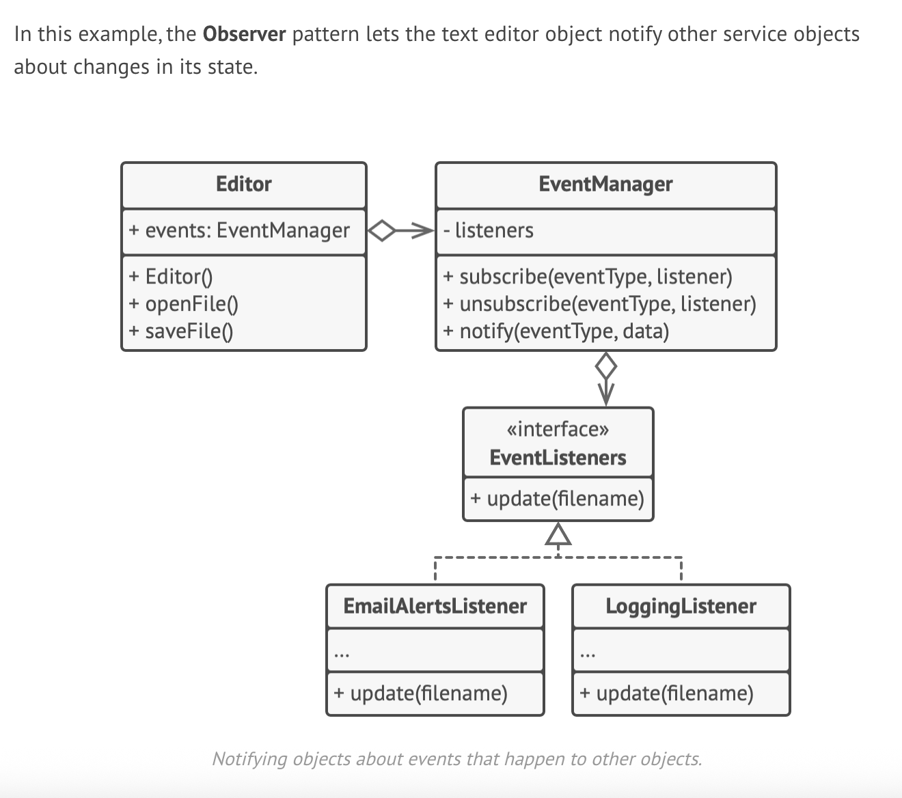

# Observer Design Pattern

UML diagram of observer

# 🧩 Observer Pattern

## 📌 When to Use (In Simple Words)

- Use the Observer Pattern when one object changes and other objects need to know — but you don’t know who those objects are in advance.
- Example: In a GUI app, a button can allow others to attach custom code that runs on click.
- It's ideal when subscribers may join or leave at runtime.

---

## ⚙️ How to Implement the Observer Pattern

### 1. Split Your Logic
- The **Publisher** handles the core logic and event generation.
- The **Subscribers** react to those events.

### 2. Create a Subscriber Interface
- Define a common method like `update()` that all subscribers must implement.

### 3. Create a Publisher Interface
- Include methods to `addSubscriber()` and `removeSubscriber()`.
- The publisher should only talk to subscribers through this interface.

### 4. Manage Subscriptions
- Keep a list of subscribers in an abstract base class that implements the publisher interface.
- If you're working with an existing hierarchy, use composition by creating a separate class to manage subscribers.

### 5. Implement Concrete Publishers
- Extend the base publisher class and call `notifySubscribers()` whenever something changes.

### 6. Implement Concrete Subscribers
- Implement the `update()` method with custom behavior.
- You can pass event data directly to `update()`, or pass the publisher so the subscriber can fetch more context.

### 7. Client Code
- Create subscriber instances and register them with the appropriate publishers at runtime.

---

## ✅ Benefits

- **Open/Closed Principle**: Add new subscribers without changing publisher code.
- **Loose coupling** between publishers and subscribers.
- **Dynamic relationships**: Subscribers can join or leave as needed.

