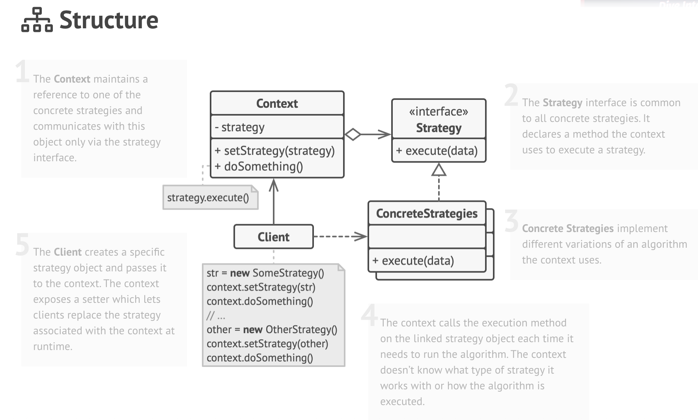
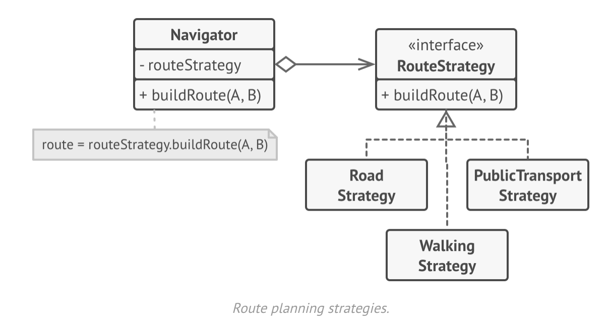

# Strategy Design Pattern

UML diagram of strategy

## 📌 Strategy Design Pattern: Applicability

## 💡 Applicability: When to Use the Strategy Pattern

- **Use the Strategy pattern when you want to use different variants of an algorithm within an object and be able to switch from one algorithm to another during runtime.**  
  The Strategy pattern enables runtime behavior changes by associating the object with interchangeable sub-objects that perform tasks in different ways.

- **Use when you have many similar classes that differ only in how they execute a certain behavior.**  
  By extracting the varying behavior into separate strategy classes, you reduce duplication and keep your codebase clean.

- **Use when you want to separate business logic from algorithm implementation details.**  
  The Strategy pattern allows isolating complex logic into reusable, replaceable components while keeping the main class simple and focused.

- **Use when your class contains large conditional blocks to select behavior.**  
  Instead of using `if`/`switch` statements, you can encapsulate each variant into its own class and delegate behavior selection to the strategy context.

## 🛠️ How to Implement the Strategy Pattern

1. **Identify the algorithm** in the context class that is prone to change or uses large conditional logic.
2. **Define a common Strategy interface** for all algorithm variants.
3. **Extract each algorithm** into its own class, implementing the Strategy interface.
4. In the **Context class**:
    - Add a field to hold a reference to a Strategy.
    - Add a setter to change the Strategy dynamically.
    - Interact with the Strategy only via the interface.
    - Optionally, provide context accessors for strategies that need context data.
5. **Clients** must assign the appropriate strategy to the context before execution.

---

## ✅ Pros and ❌ Cons

### ✅ Pros:
- You can **swap algorithms at runtime** without modifying the context.
- Helps in **isolating algorithm implementation** from the main class logic.
- Promotes **composition over inheritance**.
- Adheres to the **Open/Closed Principle** – add new strategies without changing existing code.

### ❌ Cons:
- Adds extra **classes and interfaces**, which may be overkill for a few rarely changing algorithms.
- **Clients must know** about all available strategies to select the right one.
- In languages with **first-class functions**, strategies can be replaced with simple lambda expressions, making the pattern less useful.

---

## 🔗 Relation to Other Patterns

- **Strategy vs Command**:  
  Both can parameterize objects with behavior, but:
    - `Command` encapsulates an entire operation and can support queuing, undo, logging.
    - `Strategy` focuses on **selecting one of many interchangeable algorithms**.

- **Strategy vs Template Method**:
    - `Template Method` uses **inheritance** to override parts of an algorithm (compile-time/static).
    - `Strategy` uses **composition**, allowing **runtime behavior switching**.

- **Strategy vs State**:
    - `Strategy` keeps behaviors independent.
    - `State` allows state objects to transition and **mutate the context**.

- **Strategy vs Decorator**:
    - `Decorator` alters **object behavior externally** (like adding layers).
    - `Strategy` alters **core algorithm behavior internally**.

- **Strategy vs Bridge/Adapter**:
    - All rely on **composition**, but solve different problems:
        - `Bridge`: separate abstraction from implementation.
        - `Adapter`: make incompatible interfaces compatible.
        - `Strategy`: swap algorithms.
        - `State`: swap object state behavior dynamically.
