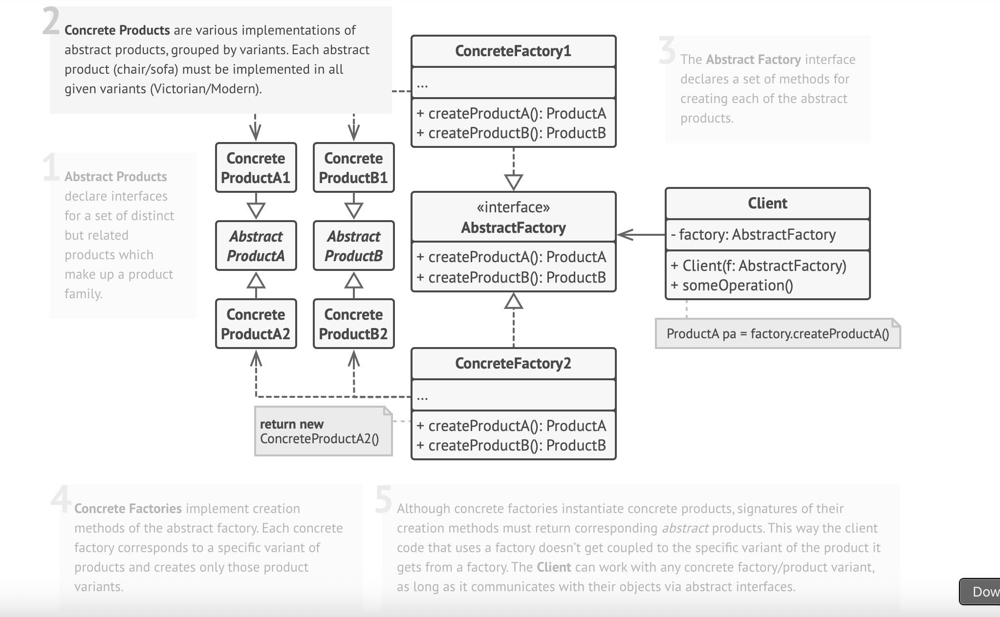
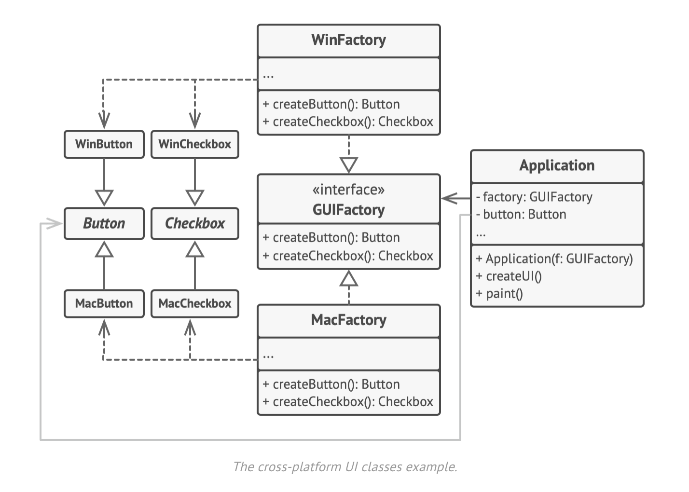

## Abstract Factory Design Pattern

UML diagram of Abstract Factory

# Abstract Factory Pattern – README

> **Definition**  
> **Abstract Factory** is a creational design pattern that produces **families
> of related objects** without revealing their concrete classes.

---

## 🎯 Problem

* Applications often need multiple **variants** of a product family  
  (e.g. *Modern* vs *Victorian* furniture).
* Mixing variants leads to mismatched UI elements or domain objects  
  (a Modern sofa with Victorian chairs — yikes!).
* Adding new variants should not require editing existing business logic.

---

## 💡 Solution

1. **Define an interface for each product type** in the family  
   (`Chair`, `Sofa`, `CoffeeTable`, …).
2. **Create an `AbstractFactory` interface** that declares a *creation method*
   for every product type (`createChair()`, `createSofa()`, …).
3. **Implement a concrete factory** per variant  
   (`ModernFurnitureFactory`, `VictorianFurnitureFactory`, …).  
   Each returns products of one variant that all “match” each other.
4. **Client code depends only on the abstract interfaces**; swapping the
   factory at runtime instantly switches the entire product family.

---

## 📌 Applicability

| Use When… | Because… |
|-----------|----------|
| You must guarantee that **products in a family are compatible**. | A single factory always yields matching objects. |
| Your code **shouldn’t know** about concrete classes. | All creation is funneled through abstract interfaces. |
| You foresee **new variants** arriving frequently. | Add a new factory and concrete products—no client changes. |

---

# Abstract Factory Pattern – README

> **Definition**  
> The **Abstract Factory** is a creational pattern that supplies an interface
> for creating **families of related objects** without binding client code to
> their concrete classes.

---

## 📌 Applicability

| Use It When… | Why It Helps |
|--------------|--------------|
| Your code must work with **multiple families** of related products, but you don’t want it to know their concrete classes. | Guarantees that products created together are **compatible**. |
| A class accumulates several **Factory Methods**, diluting its main responsibility. | Extracting them into an Abstract Factory restores **single-purpose** design. |
| You anticipate **new product variants** or environments (e.g., Modern vs. Victorian UI). | Add a new factory; existing business logic stays intact. |

---

## 🏗️ How to Implement

1. **Map a product matrix**  
   *Rows*: product types (`Button`, `Checkbox`, `Window`)  
   *Columns*: variants (`LightTheme`, `DarkTheme`).

2. **Define abstract product interfaces** for every cell in the matrix.

3. **Declare an `AbstractFactory` interface** containing creation methods for each product type.

4. **Implement one concrete factory per variant**, each returning matching product objects.

5. **Initialize** the appropriate concrete factory at app start — choose based on configuration, environment, or user preference.

6. **Inject** this factory into every class that needs to create products.

7. **Refactor**: replace direct `new ConcreteProduct()` calls with factory calls
   (`factory.createButton()`, etc.).

---

## ✅ Pros

* **Compatibility assured** – all products from one factory work well together.
* **Loose coupling** – client code depends on abstractions, not concrete classes.
* **Single Responsibility Principle** – creation logic lives in one place.
* **Open/Closed Principle** – add new product variants without changing existing code.

## ⚠️ Cons

* **Increased complexity** – more interfaces and classes to maintain.

---

## 📝 Key Takeaways

* Think of Abstract Factory as a **“factory of factories”** that enforces
  consistent object families.
* Swapping the factory instance instantly switches the entire product theme or
  platform.
* Ideal for plug-in architectures, cross-platform UIs, and any scenario where
  product compatibility is crucial.

---
