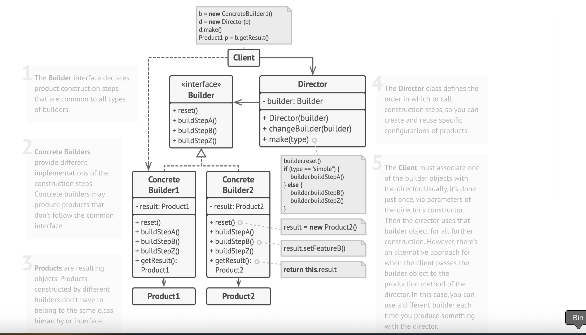
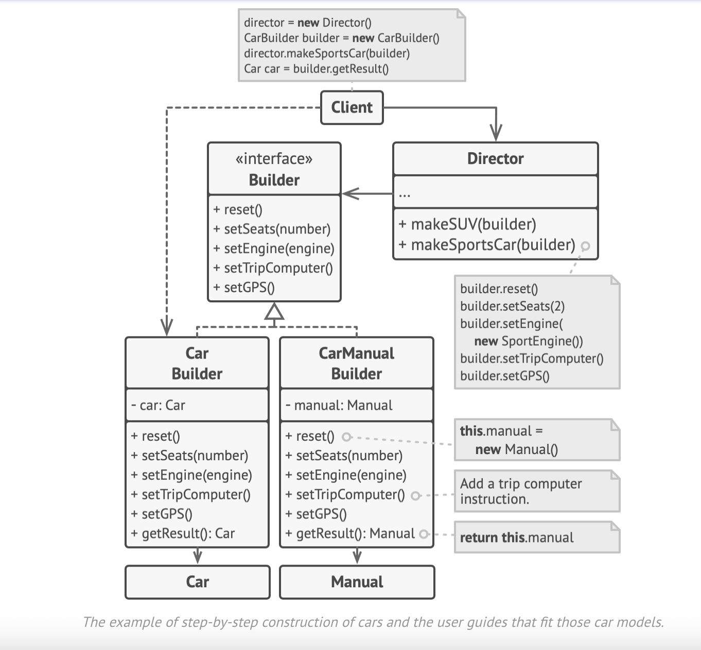

# Builder Design Pattern

UML diagram of builder




# 🏗️ Builder Pattern

## 📌 Problem

Creating complex objects with many parts can lead to:
- **Huge constructors** with too many parameters (most of them unused).
- **Too many subclasses** for every object variation.
- **Messy and duplicated code** scattered across the app.

---

## ✅ Solution

The **Builder Pattern** helps by moving the construction logic to a separate **builder** class.

- It builds the object **step by step**.
- You only call the steps you **actually need**, making the code clean and flexible.
- Different builders can create different versions of the object using the same steps.
    - For example: a **wooden house**, **stone castle**, or **gold palace**.

---

## 🧱 Optional: Director

You can use a **Director** class to define the exact order of building steps.

- It separates **what to build** (builder) from **how to build it** (director).
- The client just assigns a builder to the director and gets the final product.
- This keeps construction reusable and easy to manage.

---

## ✅ Benefits

- Avoids telescoping constructors.
- Clean and readable object creation.
- Supports various product configurations.
- Better separation of concerns.

Builder Design Pattern
✅ Applicability
Use the Builder pattern when:

## Builder Design Pattern

### Overview
The **Builder pattern** separates the construction of a complex object from its
representation, allowing you to build objects step-by-step and produce different
variants without cluttering client code with telescoping constructors.

---

### Applicability
| Use It When | Why It Helps |
|-------------|--------------|
| You’re **overloaded with constructors** or many optional parameters. | Replaces unwieldy telescoping constructors with a fluent, readable API. |
| You must create **multiple representations** of the same product. | The same build sequence can yield different variants via concrete builders. |
| You construct **composite trees** or other objects incrementally. | Provides fine-grained control over each construction step. |

---

### Implementation Steps
1. **List** every step required to build the full product.
2. **Define** a `Builder` interface that declares these steps.
3. **Implement** concrete builders for each product variant.
4. **Expose** a method (e.g., `Build()` or `GetResult()`) to return the final product.
    * If return types differ, keep this method in each concrete builder.
5. **(Optional)** Create a `Director` to enforce a specific build order and re-use it across clients.

---

### Structure
```mermaid
graph LR
    Client -->|controls or delegates| Director
    Director -->|calls| BuilderInterface
    BuilderInterface --> ConcreteBuilderA & ConcreteBuilderB
    ConcreteBuilderA --> ProductA
    ConcreteBuilderB --> ProductB
    style ProductA fill:#f2f2f2,stroke:#999
    style ProductB fill:#f2f2f2,stroke:#999
