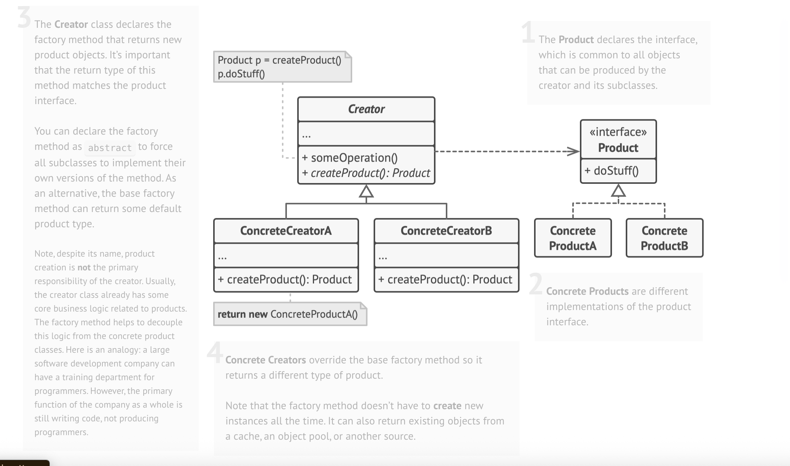
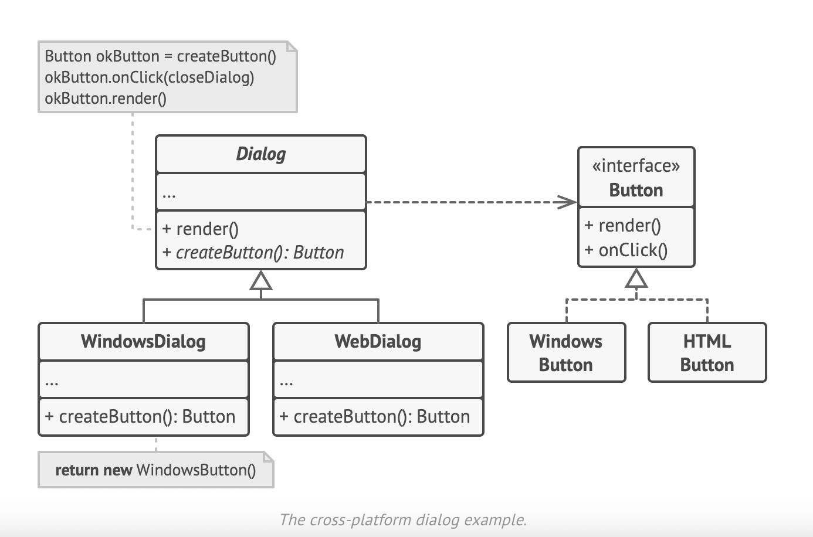

## Factory Method Design Pattern

UML diagram of Factory





### Overview
The **Factory Method** is a _creational_ pattern that defines an interface for
object creation in a superclass while letting subclasses decide which concrete
type to instantiate.  
Result: client code remains decoupled from specific classes, enabling easy
extension and cleaner maintenance.

---

### Problem 🚚 🛳
| Situation | Pain Point |
|-----------|------------|
| Logistics app originally ships **only by truck**. | All code is tightly bound to `Truck`. |
| Market demands **sea transport** (and more in future). | Adding `Ship` means touching every place that instantiates `Truck`. |
| More transport modes will appear. | Nasty `if/else` or `switch` blocks multiply across the codebase. |

---

### Solution 💡
Replace direct `new ConcreteClass()` calls with a **factory method**:

```plaintext
Client ──► Creator.factoryMethod() ──► (Truck | Ship | …)
```

# Factory Method Pattern – README

> **Definition**  
> The **Factory Method** is a creational design pattern that delegates
> object-creation to subclasses, letting them decide which concrete type
> to instantiate while keeping client code decoupled from those details.

---

## 📌 Applicability

| Use Case | Reason |
|----------|--------|
| **Unknown concrete types at compile-time** | Construction logic lives in a factory method, so new products can be introduced without touching client code. |
| **Extensible libraries / frameworks** | Third-party users override one factory method instead of modifying framework internals. |
| **Resource-intensive objects that should be reused (pools)** | Factory controls whether to create or return a cached instance, hiding complexity from callers. |

---

## 🛠️ How to Implement

1. **Define a common product interface** with operations relevant to every product.
2. **Add a `factoryMethod()`** to the creator base class; its return type must be the product interface.
3. **Replace direct constructors** in creator logic with a call to `factoryMethod()`.
4. **Derive concrete creators** for each product type and override `factoryMethod()` to return the desired instance.
5. *(Optional)* **Accept selector parameters** in the method when one creator must build multiple variants.
6. **Make the base method abstract** once all construction code has been moved to subclasses (or keep a sensible default).

---

## ✅ Pros

* **Loose coupling** between creator and concrete products.
* **Single Responsibility Principle** — construction logic resides in one place.
* **Open/Closed Principle** — introduce new product types without modifying existing code.
* Enables **object pooling / caching** behind the factory.

---

## ⚠️ Trade-offs

* **Class proliferation** — each new product usually needs its own concrete creator.
* Adds an extra layer of abstraction, which may feel heavy for very simple object graphs.

---

## 🌟 Key Takeaways

* Move object creation out of client code and into a single overridable method.
* Subclasses decide **what** to create; clients depend only on **interfaces**.
* Ideal for frameworks, plugin systems, and any scenario where future product
  variants are likely.

---
