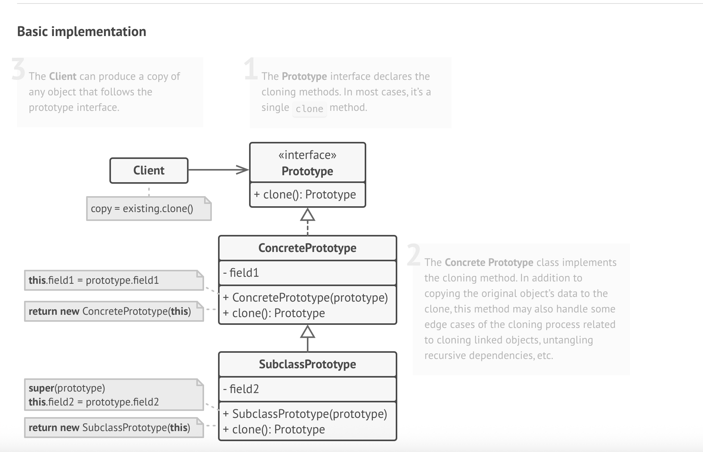
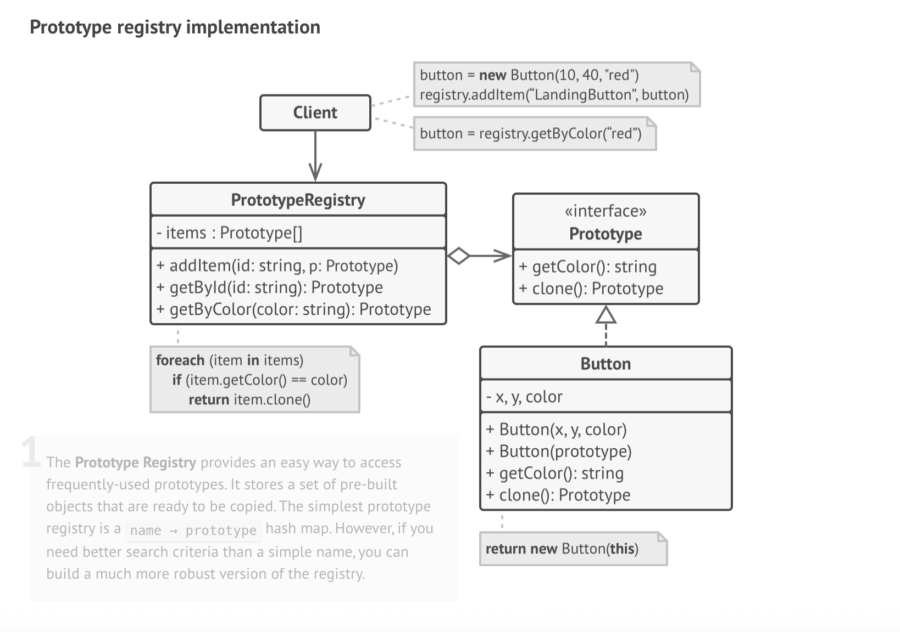

## Prototype Design Pattern

UML diagram of Prototype

# Prototype Pattern – README

> **Definition**  
> The **Prototype** is a creational pattern that creates new objects by
> **cloning existing instances** (prototypes) instead of instantiating concrete
> classes directly.

---

## 📌 Applicability

| Use When… | Why |
|-----------|-----|
| Your code must copy objects whose **concrete classes are unknown** or supplied at runtime (e.g., via plug-ins, 3rd-party APIs). | The pattern offers a uniform *clone* interface, eliminating direct dependencies on concrete classes. |
| You have many subclasses that differ **only in their initialization code**. | Replace those subclasses with a few pre-configured prototypes; clone instead of subclassing. |

---

## 🛠️ How to Implement

1. **Add a `clone()` method** to a common `Prototype` interface _or_ to each class that should be cloneable.
2. **Implement a copy constructor** (or equivalent) for every concrete class:  
   *Copy the state* of the provided instance into `this`.
3. In `clone()`, **return `new ClassName(this)`** to leverage the copy constructor (or copy fields manually if the language lacks overloading).
4. *(Optional)* **Create a prototype registry**:
    * A central factory or static map that stores frequently used prototypes.
    * Client requests a tag/key → registry clones and returns the matching prototype.
5. **Refactor client code**: replace `new ConcreteClass()` calls with  
   `prototypeRegistry.clone("desired-variant")` or `somePrototype.clone()`.

---

## ✅ Pros

* **No coupling** to concrete classes when duplicating objects.
* **Eliminates repetitive initialization** by reusing pre-built prototypes.
* **Convenient** for building complex or heavy objects (deep graphs, lots of defaults).
* **Alternative to inheritance** for configuration presets.

## ⚠️ Cons

* **Deep cloning** can be tricky—especially with circular references.
* Requires diligence to keep the `clone()` implementation in sync with class changes.

---

## 📝 Key Takeaways

* Prototype shifts focus from *constructing* to *copying* objects.
* Maintain a **clone contract**: each class is responsible for producing a
  **fully independent** copy of itself.
* A **registry** centralizes prototype management, turning duplication into a
  quick, single-line call.

---
