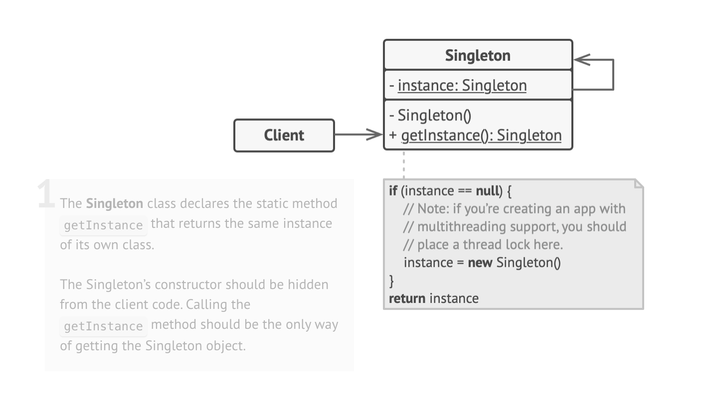

## Singleton Method Design Pattern

UML diagram of Singleton

# Singleton Pattern – README

> **Definition**  
> The **Singleton** is a creational pattern that restricts a class to **exactly one instance** and provides a global access point to that instance.

---

## 📌 Applicability

| Use When… | Why |
|-----------|-----|
| A single shared resource is required (e.g., database connection, logging service). | Guarantees one—and only one—instance for the entire app. |
| You need strict control over what would otherwise be a global variable. | Ensures controlled, centralized access and prevents unwanted reassignment. |

---

## 🛠️ Implementation Steps

1. **Private static field** – store the sole instance.
2. **Public static accessor** – `getInstance()` returns that instance.
    * Employ *lazy initialization*: create the object on first request, cache for subsequent calls.
3. **Private constructor** – block external instantiation.
4. **Refactor client code** – replace `new` calls with `Class.getInstance()`.

---

## ✅ Pros

* **Single instance guarantee** – impossible to create more unintentionally.
* **Global access point** – easy to retrieve from anywhere in the app.
* **Lazy initialization** – instance created only when first needed.

## ⚠️ Cons

* **Violates Single Responsibility** – controls both its own logic *and* its lifecycle.
* **Hides design issues** – may encourage excessive coupling or overuse of global state.
* **Thread-safety concerns** – must guard against multiple instantiations in multithreaded contexts.
* **Unit-testing difficulty** – private constructor and static state complicate mocking.

---

## 📝 Key Takeaways

* Singleton ≠ “just a global.” It enforces single instantiation and controlled access.
* Always consider if a DI container, configuration object, or plain module scope might serve better.
* In multithreaded environments, wrap the initialization in appropriate locks or use language-level features (e.g., `static` initializers in Java, `std::call_once` in C++).

---
