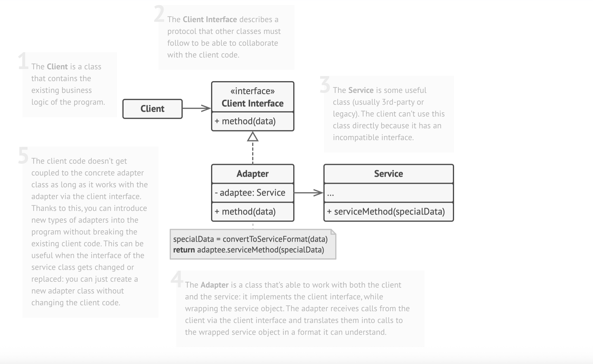
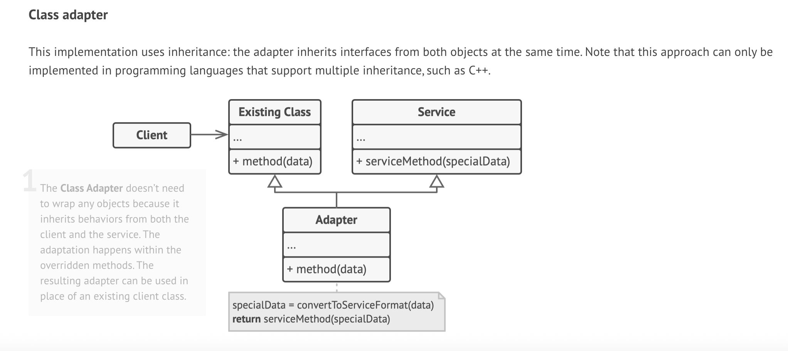

# Decorator Design Pattern

UML diagram of decorator

# 🔄 Adapter Pattern

## 📌 Applicability

Use the **Adapter Pattern** when:

- You want to use an **existing class**, but its **interface doesn't match** the rest of your code.
- You’re working with a **legacy system**, a **3rd-party library**, or a class with an unusual or incompatible interface.
- You want to **reuse multiple subclasses** that miss some functionality, and extending each one would lead to **code duplication**.

Instead of modifying or subclassing, you can wrap these objects in an **adapter** that provides the missing behavior. This works best when the original classes share a **common interface** and the adapter refers to them using that interface — similar to the **Decorator Pattern**.

---

## ⚙️ How to Implement

1. **Identify Incompatible Interfaces**
    - At least two classes must be involved:
        - A **service class** you cannot modify (e.g., legacy or 3rd-party).
        - One or more **client classes** that want to use it.

2. **Create a Client Interface**
    - Define how your client code expects to interact with a service.

3. **Build the Adapter Class**
    - Implement the **client interface**.
    - Leave method bodies empty for now.

4. **Store a Reference to the Service**
    - Add a field in the adapter to hold the service object.
    - Initialize it via the constructor or method arguments.

5. **Translate Calls**
    - In each method of the adapter, convert the request and **delegate** it to the service class.
    - Handle **data or interface conversion** as needed.

6. **Use the Adapter via the Client Interface**
    - This keeps the client code **decoupled** from the service and allows **easier extension**.

---

## ✅ Pros

- **Single Responsibility Principle**: Keeps interface/data conversion logic separate from core business logic.
- **Open/Closed Principle**: You can add new adapters without changing existing client code.
- Allows integration with **3rd-party or legacy code** without modifying it.
- Promotes **code reuse** and flexibility.

---

## ⚠️ Cons

- Adds extra **complexity** due to more classes and interfaces.
- In simple cases, modifying the service class (if possible) may be easier than introducing an adapter.
