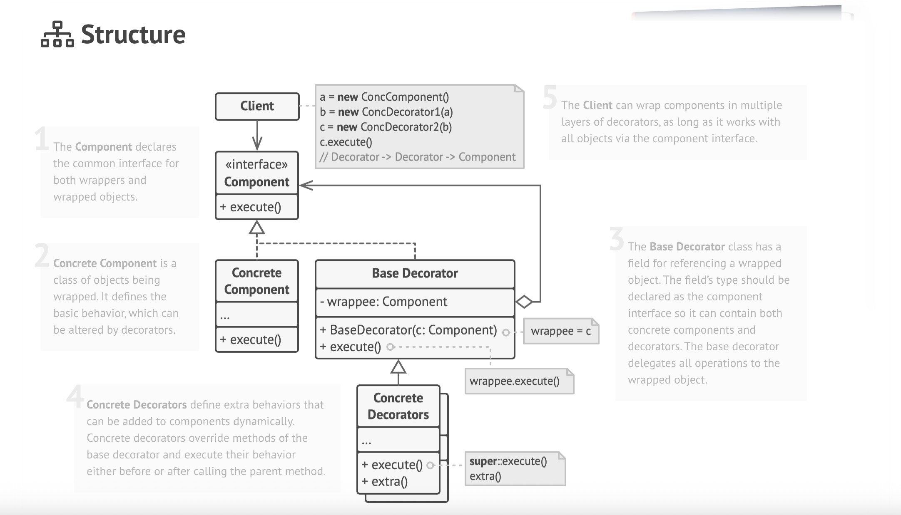
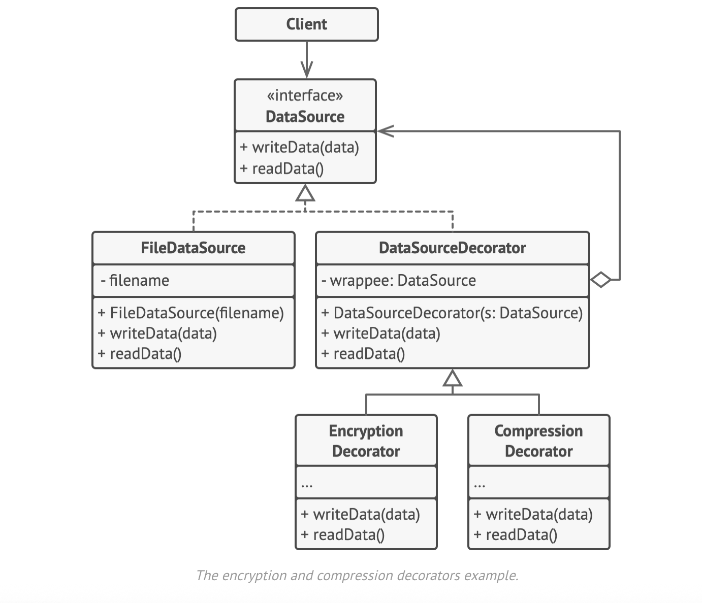

# Decorator Design Pattern

UML diagram of decorator

# 🎁 Decorator Pattern

## 📌 Applicability

- Use the **Decorator pattern** when you need to assign **extra behaviors to objects at runtime** without changing the existing code that uses those objects.
- It helps you structure business logic into **layers**, where each decorator adds specific behavior.
- Client code can use all decorated objects **interchangeably** since they share a common interface.
- Use it when **inheritance is not practical or possible**:
    - For example, when a class is marked as `final` and cannot be extended.
    - In such cases, you can **wrap** the object instead of extending it.

---

## ⚙️ How to Implement

1. **Model the Core and Layers**
    - Identify the primary component and optional behaviors that can be added over it.

2. **Create a Common Interface**
    - Define a `Component` interface that includes methods shared by the base class and all decorators.

3. **Implement the Concrete Component**
    - Create a class that implements the base behavior of the component.

4. **Create a Base Decorator**
    - Implement the same interface.
    - Store a reference to another object of the interface type.
    - Delegate all method calls to the wrapped object.

5. **Create Concrete Decorators**
    - Extend the base decorator.
    - Override methods to add behavior **before or after** delegating to the wrapped object.

6. **Client Code**
    - Compose objects dynamically by wrapping them with decorators as needed.

---

## ✅ Pros

- You can **extend an object’s behavior** without creating a new subclass.
- Behaviors can be **added or removed at runtime**.
- You can **combine multiple behaviors** by stacking decorators.
- Supports **Single Responsibility Principle** by splitting complex logic into smaller classes.

---

## ⚠️ Cons

- It can be **hard to remove** a specific decorator once wrapped.
- The final behavior may depend on the **order of decorators**, which can be tricky.
- The initial **composition setup** can look complex or messy.

---
