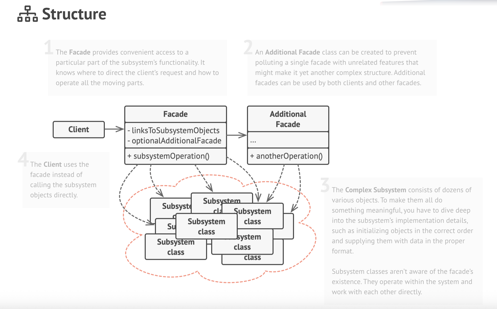
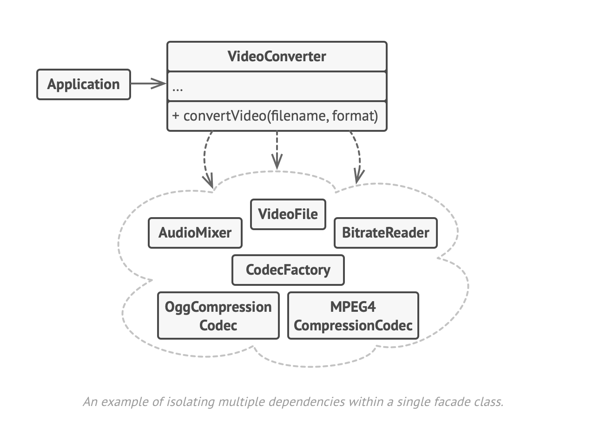

# Facade Design Pattern

UML diagram of facade




## Facade Design Pattern

### Overview
The **Facade pattern** provides a single, streamlined entry point to a complex subsystem.  
By hiding the subsystem’s internal complexity behind a simple interface, it reduces
boilerplate, lowers the learning curve for new consumers, and shields client code
from future changes.

---

### Applicability
| Use It When | Why It Helps |
|-------------|-------------|
| You need a **simple interface** to an evolving or overly complex subsystem. | Reduces the number of classes a client must understand and configure. |
| You want to **layer** a subsystem (e.g., UI → Service → Persistence). | Facades can serve as clear entry points for each layer, minimizing cross-layer coupling. |
| Multiple subsystems must **communicate** with each other. | Each subsystem can expose a facade so they interact only through well-defined APIs. |

---

### Implementation Steps
1. **Identify** the most common client operations that touch multiple subsystem classes.
2. **Design** a facade interface exposing only these operations in a concise form.
3. **Implement** the facade:
    * Instantiate and configure underlying subsystem objects.
    * Delegate each façade method to the relevant subsystem classes.
4. **Adopt** the facade in client code exclusively. Existing classes continue to work, but new code should never bypass the facade.
5. **Refine**: If the facade grows too large, split it into smaller, more focused facades (e.g., `VideoFacade` and `AudioFacade` in a media framework).

---

### Pros & Cons
| Pros | Cons |
|------|------|
| ✔ Isolates client code from subsystem complexity. | ✖ Can turn into a “god” class if it grows unchecked. |
| ✔ Simplifies upgrades—only the facade needs updates. | ✖ May add an extra layer if the subsystem is already simple. |
| ✔ Promotes cleaner, layered architecture. | |

---

### Example
```mermaid
graph TD
    Client -->|simple API| Facade
    Facade --> SubsystemA
    Facade --> SubsystemB
    SubsystemA --> ClassA1 & ClassA2
    SubsystemB --> ClassB1 & ClassB2
