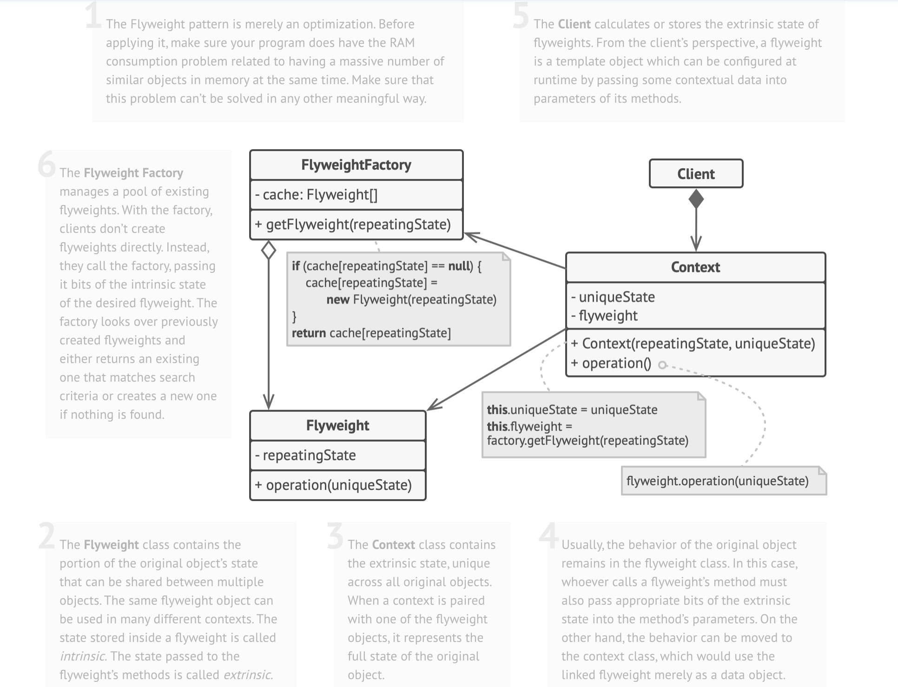
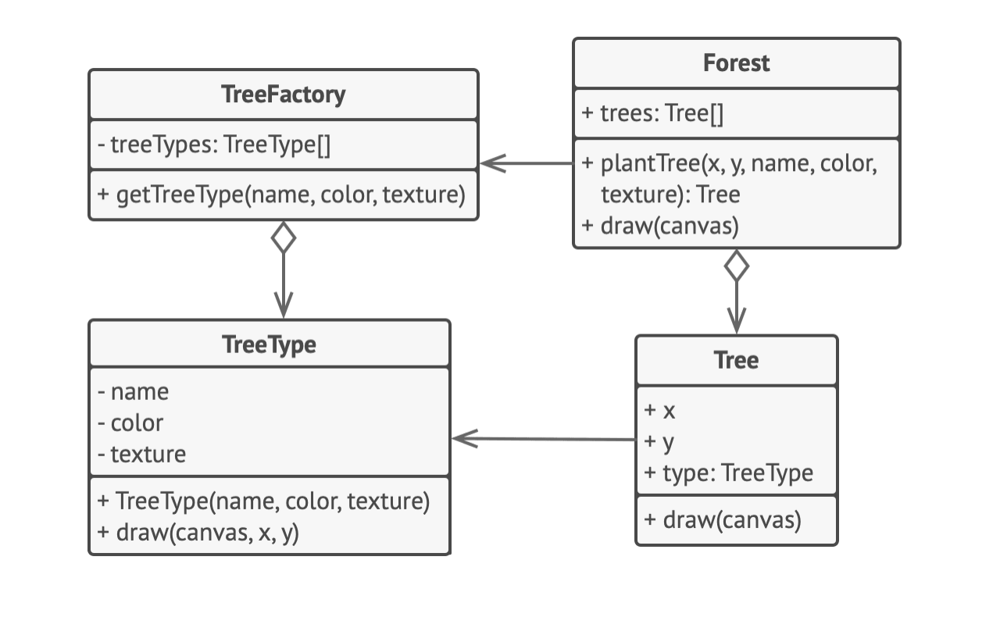

## Flyweight Design Pattern

UML diagram of Flyweight

# Flyweight Pattern – README

> **Definition**  
> The **Flyweight** is a structural pattern that minimizes memory usage by
> sharing as much data as possible among **many similar objects**. It splits
> object state into **intrinsic** (shared, immutable) and **extrinsic**
> (context-specific) parts.

---

## 📌 Applicability

| Use When… | Why It Helps |
|-----------|--------------|
| Your application must manage **huge numbers** of objects that strain RAM. | Flyweight pools duplicate data, reducing memory footprint. |
| Many objects share **identical, unchanging state**. | Move that state to a shared flyweight; store only unique context externally. |

---

## 🛠️ Implementation Steps

1. **Identify candidates** – classes whose instances are numerous and mostly identical.
2. **Split state**
    * **Intrinsic**: immutable, repeated data → keep inside the flyweight.
    * **Extrinsic**: context-specific data → pass as method parameters or store externally.
3. **Make intrinsic fields immutable** – set them only via the constructor.
4. **Refactor methods** – replace references to extrinsic fields with parameters.
5. *(Optional but common)* **Create a Flyweight Factory**
    * Maintains a pool keyed by intrinsic state.
    * Returns existing flyweights or creates new ones if needed.
6. **Client responsibilities**
    * Request flyweights **only** through the factory.
    * Supply extrinsic data whenever invoking flyweight operations.
    * Optionally wrap extrinsic data and flyweight reference in a lightweight **Context** object for convenience.

---

## ✅ Pros

* **Significant RAM savings** when many objects share state.
* Centralized sharing makes repeated data changes (if ever needed) trivial—update one flyweight, not thousands of instances.

## ⚠️ Cons

* **CPU vs. RAM trade-off** – extrinsic data may need recalculation or lookup on every call.
* **Added complexity** – codebase gains factories, context objects, and the mental overhead of split state.
* New developers may find the separation of state **non-intuitive**.

---

## 📝 Key Takeaways

* Flyweight shines in environments with **memory constraints** and large numbers of similar objects (e.g., text editors, particle systems, map tiles).
* Always measure: the pattern pays off only when **intrinsic data dwarfs extrinsic data** across many objects.
* Combine with object pooling or caching strategies to maximize benefits.

---
