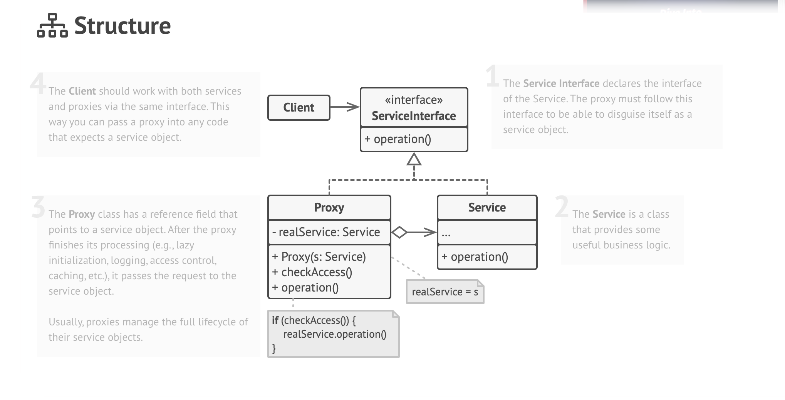
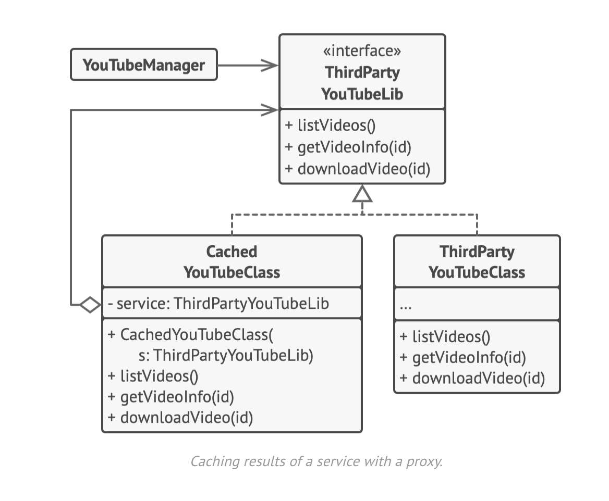

# Proxy Design Pattern

UML diagram of proxy

# 🛡️ Proxy Pattern

## 📌 Applicability

The **Proxy Pattern** provides a placeholder or surrogate for another object to control access, delay loading, add extra logic, or manage resources. Below are common use cases:

### 🔄 Lazy Initialization (Virtual Proxy)
- Use when a **heavyweight object** (e.g., large file or database connection) shouldn't be created until it's actually needed.
- Helps reduce startup time and memory usage.

### 🔐 Access Control (Protection Proxy)
- Use when you want to **restrict access** to the real object based on user credentials or roles.
- Useful in security-sensitive systems like OS components.

### 🌐 Remote Proxy
- Use when the **real object lives on a remote server**.
- The proxy handles network communication, retries, and serialization.

### 📝 Logging Proxy
- Use when you want to **log all requests** made to the real object for auditing or debugging.

### 📦 Caching Proxy
- Use when results are expensive to compute and often repeated.
- The proxy **caches** the result based on input parameters.

### 🧠 Smart Reference
- Use to **track usage of a heavy object** and release it when no longer needed.
- Helps manage memory and can also detect changes to reuse unmodified results.

---

## ⚙️ How to Implement

1. **Create a Service Interface**
    - If none exists, define a common interface for both the real object and the proxy.

2. **Create the Proxy Class**
    - It should store a **reference** to the real service object.
    - The proxy may **create**, **delay**, or **manage** the lifecycle of this service.

3. **Implement Proxy Logic**
    - Add your custom logic (e.g., logging, caching, access checks).
    - Then delegate the request to the real service object.

4. **Provide a Factory or Static Method**
    - Use a method to decide whether to return the real object or a proxy.
    - This hides the proxy from client code and makes switching seamless.

5. **Support Lazy Initialization**
    - Delay the creation of the real object until it's actually used.

---

## ✅ Pros

- ✅ You can control access to the service object **transparently**.
- ✅ Supports **lifecycle management** for expensive objects.
- ✅ Works even if the real object isn’t ready or available.
- ✅ Follows the **Open/Closed Principle** — new proxy types can be added without changing client or service code.

---

## ⚠️ Cons

- ❌ Adds complexity due to **extra classes**.
- ❌ May cause **performance delays** if proxies add overhead (e.g., logging, remote calls).
